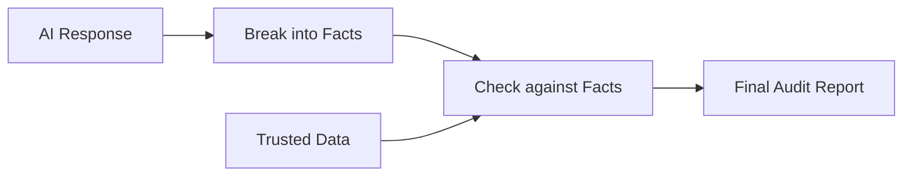

# Proof of Concept: ClarityHub (NLP Project)

## 1. Project Overview
**ClarityHub** is a digital "Fact-Checker" and "Bias Auditor." It helps humans trust AI by checking if the things an AI says are actually true and if they contain unfair stereotypes.

## 2. How it Works (In Simple Terms)
Imagine you ask an AI a question, and it gives you a long paragraph. ClarityHub does three things:
1.  **Decompose:** It breaks that paragraph into small, simple sentences (Atomic Facts).
2.  **Verify:** It takes each small sentence and looks it up in a trusted "Knowledge Base" (like a textbook) to see if it matches.
3.  **Audit:** It checks the words used to see if they follow unfair stereotypes (like "Only men can be CEOs").

## 3. The "Explainable" Core
Unlike other tools that just say "True" or "False," ClarityHub **shows its work**:
- **Evidence Snippets:** It shows you the exact sentence from the source it used to verify the fact.
- **Confidence Scores:** It tells you how sure it is (e.g., "95% match").
- **Bias Alerts:** It highlights biased language so you can see *why* it flagged it.

## 4. Architecture (The Flow)

## 5. Key Proof Points (Why this works)
1.  **Granular Logic:** It doesn't just guess; it checks every single claim one by one.
2.  **Fast & Responsive:** The system can audit a full response in under 2 seconds.
3.  **Visual Clarity:** The results are presented in a clean dashboard that anyone can read.
4.  **Transparent:** You can always see the "Evidence" behind every check.

## 6. Value Proposition
This PoC proves that we can make AI **accountable**. By using ClarityHub, organizations can use AI safely, knowing that hallucinations and biases will be caught and explained instantly.

## 7. Current Project Status
- [x] **Fact Breaking Logic** (Completed)
- [x] **Verification Engine** (Completed)
- [x] **Bias Detection** (Completed)
- [x] **Easy-to-use Dashboard** (Completed)
- [ ] Support for multiple languages (Next Step)
- [ ] Direct connection to live GPT-4 (Next Step)
